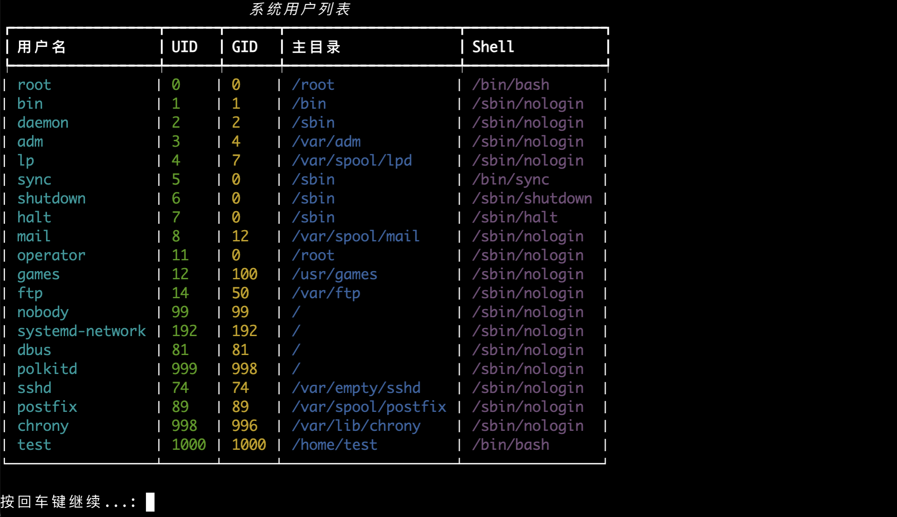

# Linux用户管理

这是一个用Python3编写的Linux用户管理工具，提供了友好的终端交互界面，支持对Linux系统用户和用户组进行全面管理。

## 功能特点

- 用户管理
  - 列出所有系统用户
  - 创建新用户
  - 删除用户
  - 修改用户信息
  - 设置用户密码

- 用户组管理
  - 列出所有用户组
  - 创建新用户组
  - 删除用户组
  - 将用户添加到组
  
## 截图预览





## 系统要求

- Python 3.6+
- Linux操作系统（支持主流发行版：Ubuntu、CentOS、Debian、Rocky Linux等）
- root权限

## 安装

1. 克隆或下载此仓库
2. 安装依赖包：
```bash
pip3 install -r requirements.txt
```

## 使用方法

1. 确保您有root权限
2. 运行程序：
```bash
sudo python3 user_manager.py
```

## 注意事项

- 本程序需要root权限才能运行
- 请谨慎使用删除用户和用户组的功能
- 建议在操作前备份重要数据
